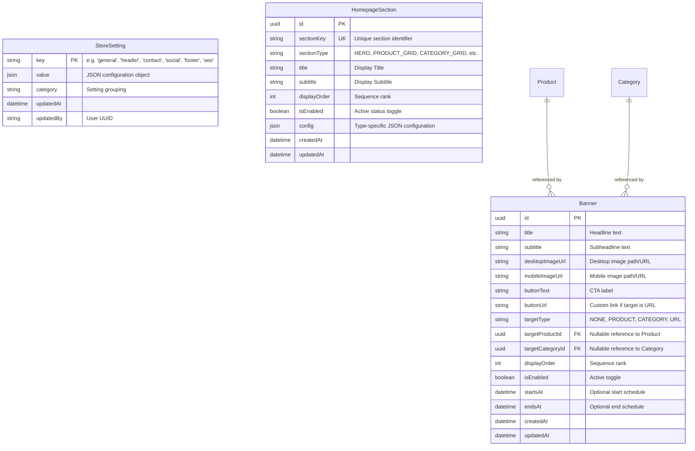

# Feature Specification: Storefront Settings & Home Page Customization System

**Feature Branch**: `005-storefront-settings`  
**Created**: 2026-08-23  
**Status**: Draft  
**Input**: Storefront Settings & Home Page Customization System specification for AIRAVÉ E-Commerce Platform.

---

## Executive Summary & System Context

The **Storefront Settings & Home Page Customization System** turns the AIRAVÉ storefront into a dynamic, configuration-driven shopping experience controlled completely from the Admin Panel. Administrators can update store branding, announcement bars, hero banners, product carousel lineups, category highlights, contact information, social links, footer details, and meta SEO tags without modifying code or redeploying frontend assets.

The system acts strictly as a **configuration and arrangement layer**. It references existing `Product`, `Category`, `Collection`, and `ProductImage` entities without duplicating catalog domain data in settings.

```text
  [ Admin Panel UI ]
         │ (Admin CRUD APIs with RBAC & Validation)
         ▼
  [ Database (StoreSetting, HomepageSection, Banner) ]
         │ (Aggregated & Filtered Query Layer)
         ▼
  [ Storefront Settings API (/api/v1/settings/storefront) ]
         │ (Next.js ISR Caching & Tag Revalidation)
         ▼
  [ Storefront App (Dynamic Section Renderer + Component Hydration) ]
```

---

## User Scenarios & Testing *(mandatory)*

### User Story 1 - Full Storefront Customization via Admin Panel (Priority: P1)

As a Store Administrator, I want to configure general store branding, contact info, social links, header/footer elements, SEO tags, and home page sections from a unified Admin Settings interface so that changes immediately apply to the storefront.

**Why this priority**: Core value proposition enabling non-technical staff to control the storefront branding and content without developer intervention.

**Independent Test**: Can be tested by changing store name, phone number, header announcement text, or social links in Admin Panel and verifying their instant appearance on `/api/v1/settings/storefront` and the storefront website.

**Acceptance Scenarios**:
1. **Given** an authenticated administrator in the Admin Panel, **When** they update general store settings (Store Name, Logo, Currency, Announcement Bar text) and submit, **Then** the database is updated, the storefront settings cache is invalidated, and the new settings reflect on the storefront.
2. **Given** an admin setting contact info or social media handles, **When** saved, **Then** Header, Footer, and Contact page components instantly reflect the updated information without code deployment.
3. **Given** an unauthorized visitor or non-admin user, **When** trying to access Admin Settings APIs, **Then** the request is rejected with `401 Unauthorized` or `403 Forbidden`.

---

### User Story 2 - Dynamic Homepage Section Reordering & Toggling (Priority: P1)

As a Merchandising Manager, I want to enable, disable, reorder, and configure homepage content sections (e.g. Hero Banner, New Arrivals, Best Sellers, Category Grid, Editorial Showcase, Newsletter) from a drag-and-drop or rank-order section manager so that homepage promotional campaigns can be updated dynamically.

**Why this priority**: High commercial impact allowing rapid adjustment of marketing focus, seasonal campaigns, and featured inventory highlights.

**Independent Test**: Disable a section (e.g., Best Sellers) or swap the order of New Arrivals and Category Grid in Admin Panel, then verify the storefront homepage immediately updates its component ordering and hides disabled sections.

**Acceptance Scenarios**:
1. **Given** a set of configured homepage sections, **When** an admin toggles a section to `disabled`, **Then** the public settings API omits or flags the section as disabled, and the storefront component renderer skips rendering it.
2. **Given** multiple active homepage sections, **When** an admin changes section display orders (e.g., 1, 2, 3 -> 2, 1, 3), **Then** the storefront renders components strictly matching the updated order sequence.
3. **Given** a product-grid or category-grid section, **When** an admin changes the section title, subtitle, selection mode (e.g., 'MANUAL' vs 'LATEST'), or selected IDs, **Then** the storefront dynamically hydrates and renders the corresponding catalog items according to the new configuration.

---

### User Story 3 - Hero & Promotional Banner Campaign Management (Priority: P2)

As a Marketing Specialist, I want to upload high-resolution desktop and mobile banner images, configure headline text, button labels, target destinations (Product, Category, or External URL), and schedule campaign start/end dates so that time-sensitive promotional banners launch automatically.

**Why this priority**: Essential for high-conversion visual marketing campaigns, seasonal sales, and targeted product callouts.

**Independent Test**: Create a new hero banner with desktop/mobile images and a target category URL in Admin Panel, then confirm the Hero Banner slider on the storefront displays the new poster image and navigates to the target category upon click.

**Acceptance Scenarios**:
1. **Given** a marketing banner configured with a target product or category, **When** a user clicks the banner action button on the storefront, **Then** the user is navigated directly to the target product or category page.
2. **Given** a banner with scheduled start and end dates (`startsAt`, `endsAt`), **When** current time is outside the validity window, **Then** the public settings API excludes the banner from the active storefront response.
3. **Given** a banner referencing a deleted product or category, **When** requested by storefront, **Then** the target gracefully degrades to a default fallback URL or section without crashing the hero component.

---

### User Story 4 - Public Storefront High-Performance Settings Consumption (Priority: P1)

As a Storefront Customer, I want the homepage and global components to load instantly with zero layout shifts and optimal page load speeds, consuming settings via a single consolidated API call backed by Next.js ISR caching.

**Why this priority**: Page speed and stability directly drive user conversion, retention, and SEO rankings.

**Independent Test**: Measure initial server response time and API latency for `GET /api/v1/settings/storefront`. Validate that settings are returned in a single JSON payload under 50ms (when cached) and that the homepage renders without layout shift.

**Acceptance Scenarios**:
1. **Given** any customer landing on the homepage, **When** the page builds or revalidates via ISR, **Then** settings are retrieved from `/api/v1/settings/storefront` in a single request.
2. **Given** a backend API failure or database unavailability, **When** storefront fetches settings, **Then** the application falls back gracefully to default system settings without throwing fatal error screens.

---

### Edge Cases

- **Deleted Entity Reference**: What happens when a configured section or banner references a `productId` or `categoryId` that is soft-deleted or archived in database?
  - *Behavior*: The settings service filters out invalid/deleted references during data aggregation, or the section selection mode automatically falls back to system defaults (e.g. latest products).
- **Empty Active Sections**: What happens if an admin disables ALL homepage sections?
  - *Behavior*: Storefront homepage renders a clean empty state fallback banner or defaults to showing minimal Hero + Category navigation without throwing runtime errors.
- **Concurrent Admin Updates**: What happens if two admins edit settings at the same time?
  - *Behavior*: Standard optimistic database locking with timestamp checking (`updatedAt`), preserving the last valid write and recording an entry in `AuditLog`.
- **Malformed JSON Configuration**: What happens if invalid JSON config is submitted for a custom section type?
  - *Behavior*: Strict server-side Zod validation rejects invalid payload schemas at the controller level before database persistence.

---

## Requirements *(mandatory)*

### Functional Requirements

#### 1. General Store Settings
- **FR-001**: System MUST store and manage general store metadata including Store Name, Store Description, Logo URL, Favicon URL, Default Currency (e.g. `INR`), Default Language (`en`), Timezone (`Asia/Kolkata`), and Maintenance Mode state.
- **FR-002**: When Maintenance Mode is `enabled`, the public storefront MUST present a configurable maintenance splash screen while preserving administrative bypass access.

#### 2. Header & Navigation Settings
- **FR-003**: System MUST support toggleable Announcement Bar with custom announcement text, background color mode, and optional action link.
- **FR-004**: System MUST allow configuring search bar visibility, wishlist icon visibility, cart drawer visibility, and user account menu visibility in the global header.

#### 3. Home Page Section Management
- **FR-005**: System MUST treat the storefront homepage as an ordered list of dynamic sections.
- **FR-006**: Each section MUST include: Unique ID, Section Key, Section Type, Title, Subtitle, Display Order (integer rank), Enabled/Disabled toggle, and Type-Specific Configuration JSON.
- **FR-007**: System MUST support built-in section types: `HERO`, `BRAND_BANNER`, `CATEGORY_GRID`, `PRODUCT_GRID`, `FEATURED_PRODUCTS`, `NEW_ARRIVALS`, `BEST_SELLERS`, `TRENDING_PRODUCTS`, `SALE_PRODUCTS`, `EDITORIAL_SHOWCASE`, `CUSTOM_BANNER`, `CUSTOMER_REVIEWS`, and `NEWSLETTER`.
- **FR-008**: System architecture MUST permit registering new future section types without schema migrations or core system refactoring.

#### 4. Hero & Campaign Banner Management
- **FR-009**: System MUST allow administrators to manage multiple hero/campaign banners with desktop image URL, mobile image URL, headline title, subtitle, CTA button text, CTA button URL, display order, enable/disable status, and optional start/end scheduling dates (`startsAt`, `endsAt`).
- **FR-010**: Banners MUST support target entity types: `NONE`, `PRODUCT`, `CATEGORY`, or `EXTERNAL_URL`. Catalog entity targets MUST reference existing `Product.id` or `Category.id` without duplicating catalog data.

#### 5. Category Configuration
- **FR-011**: System MUST allow administrators to select which categories appear in homepage category carousels or grids, specify their display order, and override display titles if desired.
- **FR-012**: System MUST reuse existing `Category` model data (`imageUrl`, `name`, `slug`) and avoid creating duplicate category media tables.

#### 6. Product Section Configuration
- **FR-013**: System MUST support configurable product sections (Featured, New Arrivals, Best Sellers, Trending, Sale, Manual Selection).
- **FR-014**: Product sections MUST support configurable limits (e.g., 4 to 12 items), selection modes (`MANUAL`, `LATEST`, `BEST_SELLING`, `TRENDING`, `FEATURED`, `ON_SALE`), custom section titles, and ordered lists of manually selected product IDs when in `MANUAL` mode.
- **FR-015**: Product sections MUST reuse existing `Product` model entries without duplicating product fields into settings storage.

#### 7. Contact Information Settings
- **FR-016**: System MUST centralize store contact information including Primary Phone, Secondary Phone, Primary Email, Support Email, WhatsApp Number, Physical Address, City, State, Country, Postal Code, Working Hours string, and Google Maps embed/direct URL.
- **FR-017**: Centralized contact information MUST be shared and re-usable across Header, Footer, Contact Us page, and order confirmation communications.

#### 8. Social Media Settings
- **FR-018**: System MUST configure social platform links for Instagram, Facebook, YouTube, X/Twitter, LinkedIn, Pinterest, and WhatsApp. Each entry MUST support URL string and enabled/disabled state.

#### 9. Footer Configuration
- **FR-019**: System MUST configure footer elements: store description paragraph, contact info visibility, social links visibility, newsletter form visibility, custom footer link groups (Group Title + array of Label/URL pairs), copyright notice text, and accepted payment method icons visibility.

#### 10. SEO & Metadata Settings
- **FR-020**: System MUST configure global site SEO metadata: Meta Title template, Meta Description, Meta Keywords array, Default OpenGraph (OG) Image URL, Favicon URL, and Robots index/follow rules.
- **FR-021**: Next.js Storefront MUST consume global SEO settings to populate `<head>` tags, OpenGraph metadata tags, and JSON-LD structured data.

#### 11. API & Security Architecture
- **FR-022**: System MUST expose a single optimized public endpoint `GET /api/v1/settings/storefront` returning all active, public storefront configuration settings.
- **FR-023**: Public settings payload MUST NEVER expose administrative metadata, audit trail details, database credentials, or internal user IDs.
- **FR-024**: Admin settings management endpoints (`/api/v1/admin/settings/...`) MUST require administrative authentication (`requireAdminAuth`) and permission validation (`requirePermission("settings:manage")` or `SUPER_ADMIN`/`ADMIN` role).
- **FR-025**: All admin update requests MUST undergo strict server-side Zod validation before modifying data.

#### 12. Caching & Performance
- **FR-026**: Storefront MUST consume settings via Next.js ISR (Incremental Static Regeneration) with configurable revalidation windows (default 3600 seconds) and tag-based invalidation (`next: { tags: ['storefront-settings'] }`).
- **FR-027**: Admin Panel updates MUST trigger automatic cache tag invalidation or webhook revalidation so settings updates become effective without requiring code rebuilds or server restarts.

---

### Key Entities



1. **StoreSetting**: Key-value JSON model for store-wide singleton settings (General, Header, Contact, Social, Footer, SEO).
2. **HomepageSection**: Model managing individual dynamic storefront sections, display order, toggle state, and layout configs.
3. **Banner**: Model managing promotional slide assets, desktop/mobile images, schedules, and entity navigation targets.
4. **Product (Existing)**: Catalog domain entity referenced by product sections and banners.
5. **Category (Existing)**: Taxonomy domain entity referenced by category grids and banners.

---

## Success Criteria *(mandatory)*

### Measurable Outcomes

- **SC-001**: Storefront Settings API (`GET /api/v1/settings/storefront`) responds within **< 30ms** for cached requests and **< 120ms** for fresh database lookups.
- **SC-002**: 100% of storefront homepage section ordering, titles, visibility, hero slides, and footer elements reflect updates made in the Admin Panel without code changes.
- **SC-003**: 0% exposure of administrative attributes, user tokens, database keys, or non-public settings in the public storefront API response payload.
- **SC-004**: System handles **> 1,000 requests/second** on the public settings API using Next.js ISR and Express response header caching without performance degradation.
- **SC-005**: 100% of admin settings modification endpoints reject unauthenticated or non-admin requests with standardized HTTP `401` or `403` error payloads.
- **SC-006**: Storefront experiences **zero visual layout shift (CLS < 0.05)** when loading configuration-driven homepage components.

---

## Technical & Architectural Specifications

### 1. Database Schema Changes (Prisma)

Add the following 3 new models and 1 enum to `backend/prisma/schema.prisma`:

```prisma
enum BannerTargetType {
  NONE
  PRODUCT
  CATEGORY
  URL

  @@map("banner_target_type")
}

model StoreSetting {
  key       String   @id @db.VarChar(100)
  value     Json     @default("{}")
  category  String   @db.VarChar(50)
  updatedBy String?  @map("updated_by") @db.Uuid
  createdAt DateTime @default(now()) @map("created_at") @db.Timestamptz
  updatedAt DateTime @default(now()) @updatedAt @map("updated_at") @db.Timestamptz

  updatedByUser User? @relation(fields: [updatedBy], references: [id], onDelete: SetNull)

  @@index([category])
  @@map("store_settings")
}

model HomepageSection {
  id           String   @id @default(uuid()) @db.Uuid
  sectionKey   String   @unique @map("section_key") @db.VarChar(100)
  sectionType  String   @map("section_type") @db.VarChar(50)
  title        String?  @db.VarChar(255)
  subtitle     String?  @db.VarChar(500)
  displayOrder Int      @default(0) @map("display_order")
  isEnabled    Boolean  @default(true) @map("is_enabled")
  config       Json     @default("{}")
  createdAt    DateTime @default(now()) @map("created_at") @db.Timestamptz
  updatedAt    DateTime @default(now()) @updatedAt @map("updated_at") @db.Timestamptz

  @@index([isEnabled, displayOrder])
  @@map("homepage_sections")
}

model Banner {
  id               String           @id @default(uuid()) @db.Uuid
  title            String?          @db.VarChar(255)
  subtitle         String?          @db.VarChar(500)
  desktopImageUrl  String           @map("desktop_image_url")
  mobileImageUrl   String?          @map("mobile_image_url")
  buttonText       String?          @map("button_text") @db.VarChar(100)
  buttonUrl        String?          @map("button_url") @db.VarChar(500)
  targetType       BannerTargetType @default(NONE) @map("target_type")
  targetProductId  String?          @map("target_product_id") @db.Uuid
  targetCategoryId String?          @map("target_category_id") @db.Uuid
  displayOrder     Int              @default(0) @map("display_order")
  isEnabled        Boolean          @default(true) @map("is_enabled")
  startsAt         DateTime?        @map("starts_at") @db.Timestamptz
  endsAt           DateTime?        @map("ends_at") @db.Timestamptz
  createdAt        DateTime         @default(now()) @map("created_at") @db.Timestamptz
  updatedAt        DateTime         @default(now()) @updatedAt @map("updated_at") @db.Timestamptz

  targetProduct  Product?  @relation(fields: [targetProductId], references: [id], onDelete: SetNull)
  targetCategory Category? @relation(fields: [targetCategoryId], references: [id], onDelete: SetNull)

  @@index([isEnabled, displayOrder])
  @@index([startsAt, endsAt])
  @@map("banners")
}
```

---

### 2. REST API Specification

#### Public Storefront API

##### `GET /api/v1/settings/storefront`
- **Auth**: None (Public)
- **Cache-Control**: `public, max-age=3600, s-maxage=86400, stale-while-revalidate=60`
- **Response Payload Structure**:

```json
{
  "success": true,
  "data": {
    "store": {
      "name": "AIRAVÉ",
      "description": "Luxury High-Fashion Streetwear & Contemporary Apparel",
      "logoUrl": "/images/logo.svg",
      "faviconUrl": "/favicon.ico",
      "currency": "INR",
      "defaultLanguage": "en",
      "timezone": "Asia/Kolkata",
      "maintenanceMode": false
    },
    "header": {
      "announcementBar": {
        "enabled": true,
        "text": "COMPLIMENTARY EXPRESS SHIPPING ON ORDERS OVER ₹5,000",
        "link": "/collections/new-arrivals"
      },
      "searchVisible": true,
      "wishlistVisible": true,
      "cartVisible": true,
      "accountVisible": true
    },
    "home": {
      "sections": [
        {
          "id": "sec-001",
          "sectionKey": "hero_slider",
          "sectionType": "HERO",
          "title": "SPRING / SUMMER '26",
          "subtitle": "MONOCHROME ESSENTIALS",
          "displayOrder": 1,
          "isEnabled": true,
          "config": { "autoplay": true, "interval": 5000 }
        },
        {
          "id": "sec-002",
          "sectionKey": "new_arrivals_grid",
          "sectionType": "NEW_ARRIVALS",
          "title": "NEW ARRIVALS",
          "subtitle": "Fresh from the atelier",
          "displayOrder": 2,
          "isEnabled": true,
          "config": {
            "limit": 6,
            "selectionMode": "LATEST"
          }
        }
      ],
      "banners": [
        {
          "id": "ban-001",
          "title": "URBAN TECHWEAR CAPSULE",
          "subtitle": "Engineered for movement and high-contrast aesthetics",
          "desktopImageUrl": "https://images.unsplash.com/photo-1509631179647-0177331693ae",
          "mobileImageUrl": "https://images.unsplash.com/photo-1509631179647-0177331693ae",
          "buttonText": "EXPLORE CAPSULE",
          "targetType": "CATEGORY",
          "targetSlug": "outerwear",
          "targetId": "cat-uuid-123"
        }
      ]
    },
    "contact": {
      "phone": "+91 98765 43210",
      "secondaryPhone": "+91 98765 43211",
      "email": "concierge@airave.com",
      "supportEmail": "support@airave.com",
      "whatsapp": "+919876543210",
      "address": "104 Atelier Boulevard, Fashion District",
      "city": "Mumbai",
      "state": "Maharashtra",
      "country": "India",
      "postalCode": "400001",
      "workingHours": "Mon - Sat: 10:00 AM - 8:00 PM IST",
      "googleMapsUrl": "https://maps.google.com/?q=Airave"
    },
    "social": {
      "instagram": { "enabled": true, "url": "https://instagram.com/airave" },
      "facebook": { "enabled": true, "url": "https://facebook.com/airave" },
      "youtube": { "enabled": true, "url": "https://youtube.com/@airave" },
      "twitter": { "enabled": true, "url": "https://x.com/airave" },
      "linkedin": { "enabled": false, "url": "" },
      "pinterest": { "enabled": true, "url": "https://pinterest.com/airave" },
      "whatsapp": { "enabled": true, "url": "https://wa.me/919876543210" }
    },
    "footer": {
      "description": "AIRAVÉ represents contemporary minimalist tailoring, combining sculptural silhouettes with unyielding monochrome precision.",
      "showContactInfo": true,
      "showSocialLinks": true,
      "showNewsletter": true,
      "linkGroups": [
        {
          "title": "SHOP",
          "links": [
            { "label": "New Arrivals", "url": "/collections/new-arrivals" },
            { "label": "Bestsellers", "url": "/collections/top-selling" }
          ]
        }
      ],
      "copyrightText": "© 2026 AIRAVÉ ATELIER. ALL RIGHTS RESERVED.",
      "showPaymentMethods": true
    },
    "seo": {
      "siteTitle": "AIRAVÉ — High-Fashion Streetwear & Contemporary Apparel",
      "siteDescription": "Discover minimalist streetwear, oversized tailoring, and monochrome luxury silhouettes.",
      "keywords": ["streetwear", "luxury fashion", "monochrome", "airave", "menswear"],
      "defaultOgImage": "https://airave.com/og-image.jpg",
      "faviconUrl": "/favicon.ico",
      "robots": "index, follow"
    }
  }
}
```

---

#### Admin Management Endpoints

All admin endpoints require `requireAdminAuth` and `requirePermission("settings:manage")`.

| Method | Endpoint | Description |
| :--- | :--- | :--- |
| `GET` | `/api/v1/admin/settings` | Retrieve raw setting key-values across all categories |
| `PUT` | `/api/v1/admin/settings/:group` | Update settings key-value payload for a specific category (`general`, `header`, `contact`, `social`, `footer`, `seo`) |
| `GET` | `/api/v1/admin/settings/sections` | Fetch all homepage sections (enabled & disabled) sorted by `displayOrder` |
| `POST` | `/api/v1/admin/settings/sections` | Create a new dynamic homepage section |
| `PUT` | `/api/v1/admin/settings/sections/reorder` | Bulk update section `displayOrder` ranks |
| `PUT` | `/api/v1/admin/settings/sections/:id` | Update section title, subtitle, isEnabled state, and config JSON |
| `DELETE`| `/api/v1/admin/settings/sections/:id` | Remove a dynamic homepage section |
| `GET` | `/api/v1/admin/settings/banners` | List all promotional/hero banners |
| `POST` | `/api/v1/admin/settings/banners` | Create a promotional banner entry |
| `PUT` | `/api/v1/admin/settings/banners/:id` | Update banner details, scheduling, and target relations |
| `DELETE`| `/api/v1/admin/settings/banners/:id` | Delete banner entry |

---

### 3. Admin Panel UI Specification

**Location**: `admin/src/app/(dashboard)/settings/page.tsx`

The Settings area will be implemented using standard AIRAVÉ monochrome design system primitives (`tabs`, `card`, `input`, `button`, `dialog`, `badge`, `switch`):

```text
 Settings
 ┌─────────────────────────────────────────────────────────────────────────────┐
 │ [ General ] [ Home Page ] [ Header ] [ Footer ] [ Contact ] [ Social ] [ SEO ] [ Banners ] │
 └─────────────────────────────────────────────────────────────────────────────┘
```

#### Home Page Visual Section Manager
- **Section List View**: Displays all configured homepage sections in order cards.
- **Controls on each Section Card**:
  - **Drag Handle / Reorder Buttons**: Move Up / Move Down or Drag to change rank.
  - **Enable/Disable Switch**: Toggle `isEnabled` boolean directly.
  - **Edit Button**: Opens slide-over `Sheet` or `Dialog` to configure section title, subtitle, product limit, and product selection mode (`MANUAL`, `LATEST`, `BEST_SELLING`, etc.).
  - **Product/Category Selector**: When in `MANUAL` mode, opens a modal to choose catalog items from backend.

#### Banner Manager
- Table/Grid view showing banner preview images, headline title, schedule status badge (`ACTIVE`, `SCHEDULED`, `EXPIRED`, `DISABLED`), target type badge (`PRODUCT`, `CATEGORY`, `URL`), and quick toggle switch.

---

### 4. Storefront Rendering Architecture

**Location**: `frontend/src/components/home/HomepageSectionRenderer.tsx`

The homepage (`frontend/src/app/(shop)/page.tsx`) converts into a configuration-driven section engine:

```tsx
// Dynamic Section Mapper Architecture
const SECTION_COMPONENT_MAP: Record<string, React.ComponentType<any>> = {
  HERO: HeroBanner,
  BRAND_BANNER: BrandBanner,
  NEW_ARRIVALS: NewArrivals,
  CURATED_COLLECTIONS: CuratedCollections,
  CATEGORY_GRID: CategoryGrid,
  EDITORIAL_SHOWCASE: EditorialShowcase,
  TOP_SELLING: TopSelling,
  RECOMMENDATIONS: PersonalizedRecommendations,
  CUSTOMER_REVIEWS: CustomerReviews,
  NEWSLETTER: NewsletterBanner,
};

export function HomepageSectionRenderer({ section, storefrontData }: { section: HomepageSection; storefrontData: any }) {
  if (!section.isEnabled) return null;

  const Component = SECTION_COMPONENT_MAP[section.sectionType];
  if (!Component) return null;

  return <Component config={section.config} title={section.title} subtitle={section.subtitle} />;
}
```

---

## Assumptions & Scope Bounding

- **Domain Model Isolation**: Settings WILL NOT replicate catalog entities (`Product`, `Category`). Settings only record entity UUIDs or slugs as configuration references.
- **Database Engine**: Uses existing PostgreSQL database with Prisma ORM.
- **Image Storage**: Banner and logo image uploads leverage existing admin upload presigning service (`/api/v1/admin/upload/presign`).
- **Caching Mechanism**: Storefront relies on Next.js 14+ fetch cache revalidation tags (`next: { tags: ['storefront-settings'] }`) combined with Express HTTP cache headers.

---

## Acceptance Criteria

The feature implementation is complete and verified when all 23 criteria are met:

1. [x] **General Store Settings**: Admin can manage Store Name, Description, Logo, Favicon, Currency, Language, Timezone, and Maintenance Mode.
2. [x] **Homepage Section Management**: Admin can create, view, and configure dynamic homepage sections.
3. [x] **Section Toggling**: Admin can enable/disable sections, and disabled sections are omitted from storefront rendering.
4. [x] **Section Reordering**: Admin can reorder sections, and storefront renders sections strictly by `displayOrder`.
5. [x] **Hero/Banner Management**: Admin can upload desktop/mobile images and configure banner headlines, button labels, and display order.
6. [x] **Banner Target Routing**: Banners correctly route users to Product, Category, or External URL destinations.
7. [x] **Homepage Product Sections**: Admin can configure Product sections with selection modes (`LATEST`, `BEST_SELLING`, `MANUAL`) and custom titles.
8. [x] **Homepage Category Sections**: Admin can configure which categories appear on the homepage and their ordering.
9. [x] **Contact Settings**: Admin can centralize store contact information (phone, email, address, working hours, maps URL).
10. [x] **Social Links**: Admin can manage social links (Instagram, Facebook, YouTube, X, WhatsApp, etc.) with visibility toggles.
11. [x] **Footer Customization**: Admin can configure footer description, link groups, payment method badges, and copyright notices.
12. [x] **SEO Settings**: Admin can set global meta title, description, keywords, OG image, and robots index rules.
13. [x] **Consolidated Settings API**: Storefront retrieves all required settings in a single optimized public request `GET /api/v1/settings/storefront`.
14. [x] **Dynamic Storefront Rendering**: Storefront homepage dynamically renders sections based on API settings response.
15. [x] **Disabled Section Filter**: Disabled sections are strictly skipped during storefront page generation.
16. [x] **Ordering Enforcement**: Component render order matches database `displayOrder` sequence.
17. [x] **Domain Entity Reuse**: Existing `Product` and `Category` models are referenced without duplication.
18. [x] **RBAC Protection**: Admin endpoints enforce strict authentication and `settings:manage` permission checks.
19. [x] **Data Privacy**: Public storefront API payload strictly excludes admin keys, credentials, or internal metadata.
20. [x] **Cache Revalidation**: Settings updates in Admin invalidates storefront cache tags (`storefront-settings`).
21. [x] **Backwards Compatibility**: Existing storefront page routes and components continue functioning seamlessly.
22. [x] **UI Consistency**: Admin Panel Settings interface strictly adheres to existing AIRAVÉ design system and component standards.
23. [x] **Extensibility**: System architecture supports adding new dynamic homepage section types without database schema refactoring.

