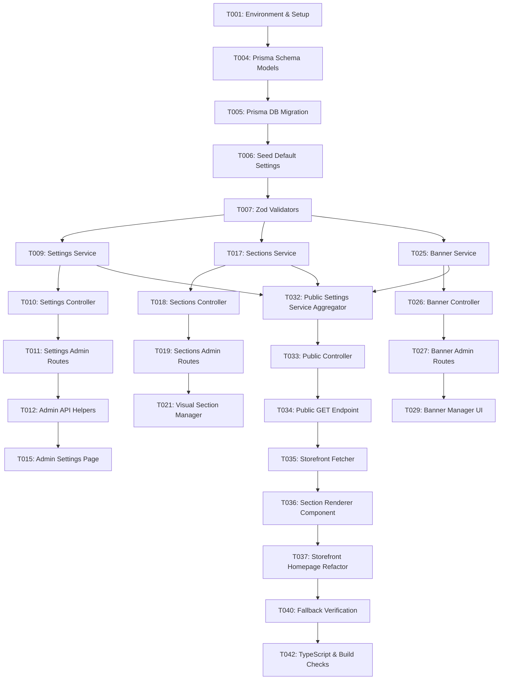

# Implementation Tasks: Storefront Settings & Home Page Customization

**Input**: Specification ([`spec.md`](spec.md)), Implementation Plan ([`plan.md`](plan.md)), Data Model ([`data-model.md`](data-model.md))

---

## Task Summary & Execution Matrix

| Phase | Category / Story | Tasks | Priority | Parallelizable |
| :--- | :--- | :--- | :--- | :--- |
| **Phase 1** | Setup & Shared Infrastructure | T001 – T003 | Foundational | Yes |
| **Phase 2** | Foundational (Database & Models) | T004 – T008 | Blocking | Partial |
| **Phase 3** | User Story 1 (Admin Settings Management) | T009 – T016 | P1 (MVP) | Yes |
| **Phase 4** | User Story 2 (Dynamic Homepage Sections) | T017 – T024 | P1 (MVP) | Yes |
| **Phase 5** | User Story 3 (Hero Banner Campaign Manager) | T025 – T031 | P2 | Yes |
| **Phase 6** | User Story 4 (Storefront Settings API & Rendering) | T032 – T039 | P1 (MVP) | Yes |
| **Phase 7** | Polish, Security & Quality Validation | T040 – T044 | Final | Yes |

---

## Phase 1: Setup & Shared Infrastructure

**Purpose**: Validate workspace configuration, environment settings, and API routes setup before introducing settings features.

- [x] T001 Review and verify database connectivity and Prisma configuration in `backend/prisma/schema.prisma`
- [x] T002 [P] Create admin settings type definitions in `admin/src/types/settings.ts`
- [x] T003 [P] Create storefront settings type definitions in `frontend/src/types/settings.ts`

---

## Phase 2: Foundational (Blocking Prerequisites)

**Purpose**: Core database tables, schemas, default seed records, and backend validators that MUST exist before API or UI work can begin.

- [x] T004 Add `BannerTargetType` enum, `StoreSetting`, `HomepageSection`, and `Banner` models to `backend/prisma/schema.prisma`
- [x] T005 Run database migration `npx prisma migrate dev --name add_storefront_settings` in `backend/`
- [x] T006 Add default seed configuration entries for store settings and default homepage sections in `backend/prisma/seed.ts`
- [x] T007 [P] Implement Zod validation schemas for general, header, contact, social, footer, SEO, section, and banner payloads in `backend/src/validators/settings.validator.ts`
- [x] T008 [P] Add settings error definitions and error handling entries in `backend/src/utils/errors.ts`

---

## Phase 3: User Story 1 — Admin Settings Management (Priority: P1)

**Goal**: Enable store administrators to configure store branding, announcement bar, contact info, social links, footer details, and meta SEO parameters from the Admin Panel.

**Independent Test**: Update Store Name, Phone Number, Announcement Bar text, and Meta Title in Admin Settings, and verify they persist in `store_settings` database table and return via `GET /api/v1/admin/settings`.

### Implementation for User Story 1

- [x] T009 [P] [US1] Implement key-value storage helper methods and database query layer in `backend/src/services/settings.service.ts`
- [x] T010 [US1] Implement administrative settings controller endpoints (`getSettings`, `updateSettingsGroup`) in `backend/src/controllers/settings.controller.ts`
- [x] T011 [US1] Register admin settings routes under `/api/v1/admin/settings` in `backend/src/routes/admin/settings.routes.ts` and mount in `backend/src/routes/admin/index.ts`
- [x] T012 [P] [US1] Implement Axios API helper client for settings endpoints in `admin/src/lib/settingsApi.ts`
- [x] T013 [P] [US1] Create General, Header, SEO, and Social settings form components in `admin/src/components/settings/GeneralSettingsForm.tsx`, `HeaderSettingsForm.tsx`, `SeoSettingsForm.tsx`, `SocialSettingsForm.tsx`
- [x] T014 [P] [US1] Create Contact and Footer settings form components in `admin/src/components/settings/ContactSettingsForm.tsx`, `FooterSettingsForm.tsx`
- [x] T015 [US1] Update Tabbed Settings Container Page in `admin/src/app/(dashboard)/settings/page.tsx` with active form tabs and save handler
- [x] T016 [US1] Add admin RBAC permission check `settings:manage` guard to admin settings routes in `backend/src/routes/admin/settings.routes.ts`

---

## Phase 4: User Story 2 — Dynamic Homepage Section Engine (Priority: P1)

**Goal**: Enable merchandising managers to enable, disable, reorder, and configure homepage section titles, selection modes, and limit properties from a visual section manager in Admin.

**Independent Test**: Reorder sections or toggle off a section in Admin Section Manager, save changes, and confirm `homepage_sections` database table updates display order sequence and active toggles.

### Implementation for User Story 2

- [x] T017 [P] [US2] Implement section CRUD and bulk reorder service methods in `backend/src/services/sections.service.ts`
- [x] T018 [US2] Implement section controller handlers (`listSections`, `updateSection`, `bulkReorderSections`) in `backend/src/controllers/settings.controller.ts`
- [x] T019 [US2] Register section administration routes (`/api/v1/admin/settings/sections`, `/api/v1/admin/settings/sections/reorder`) in `backend/src/routes/admin/settings.routes.ts`
- [x] T020 [P] [US2] Implement section manager API request helpers in `admin/src/lib/settingsApi.ts`
- [x] T021 [P] [US2] Create Section Item Card and Reorder controls in `admin/src/components/settings/HomepageSectionManager.tsx`
- [x] T022 [P] [US2] Create Section Edit Dialog for titles, product limits, and selection modes in `admin/src/components/settings/SectionEditDialog.tsx`
- [x] T023 [P] [US2] Create Product & Category selection modal picker in `admin/src/components/settings/EntityPickerModal.tsx`
- [x] T024 [US2] Integrate `HomepageSectionManager` into the Home Page tab of `admin/src/app/(dashboard)/settings/page.tsx`

---

## Phase 5: User Story 3 — Hero Banner Campaign Manager (Priority: P2)

**Goal**: Allow marketing specialists to upload desktop/mobile images, enter headlines and CTA details, configure navigation targets (Product, Category, URL), and schedule campaign start/end dates.

**Independent Test**: Create a hero banner entry with desktop/mobile images and a category target, then verify the record persists in `banners` table and respects scheduling windows (`startsAt`, `endsAt`).

### Implementation for User Story 3

- [x] T025 [P] [US3] Implement banner CRUD, target relation checking, and scheduling query logic in `backend/src/services/banners.service.ts`
- [x] T026 [US3] Implement banner controller handlers (`listBanners`, `createBanner`, `updateBanner`, `deleteBanner`) in `backend/src/controllers/settings.controller.ts`
- [x] T027 [US3] Register banner routes (`/api/v1/admin/settings/banners`) in `backend/src/routes/admin/settings.routes.ts`
- [x] T028 [P] [US3] Implement banner API request helpers in `admin/src/lib/settingsApi.ts`
- [x] T029 [P] [US3] Create Banner List Table and preview cards in `admin/src/components/settings/BannerManager.tsx`
- [x] T030 [P] [US3] Create Banner Form Dialog with desktop/mobile image upload dropzone and target entity selector in `admin/src/components/settings/BannerEditDialog.tsx`
- [x] T031 [US3] Mount `BannerManager` component into the Banners tab of `admin/src/app/(dashboard)/settings/page.tsx`

---

## Phase 6: User Story 4 — Storefront Settings API & Dynamic Rendering (Priority: P1)

**Goal**: Expose a single consolidated, high-performance public settings endpoint `GET /api/v1/settings/storefront` and render the storefront homepage dynamically based on active settings.

**Independent Test**: Execute `GET /api/v1/settings/storefront` via cURL, confirm aggregated payload returns all active settings, and verify storefront homepage renders dynamic components according to configured section ordering.

### Implementation for User Story 4

- [x] T032 [P] [US4] Implement public settings aggregation, section sorting, and active banner filtering in `backend/src/services/settings.service.ts`
- [x] T033 [US4] Implement `getStorefrontSettings` controller handler with public cache headers in `backend/src/controllers/publicSettings.controller.ts`
- [x] T034 [US4] Create public settings route `GET /api/v1/settings/storefront` in `backend/src/routes/settings.routes.ts` and mount in `backend/src/routes/index.ts`
- [x] T035 [P] [US4] Implement storefront settings API fetcher with Next.js ISR cache tags (`next: { tags: ['storefront-settings'], revalidate: 3600 }`) in `frontend/src/lib/settingsApi.ts`
- [x] T036 [P] [US4] Implement registry-based dynamic section mapper component `<HomepageSectionRenderer />` in `frontend/src/components/home/HomepageSectionRenderer.tsx`
- [x] T037 [US4] Refactor storefront homepage `frontend/src/app/(shop)/page.tsx` to fetch settings and render dynamic sections via `<HomepageSectionRenderer />`
- [x] T038 [P] [US4] Update storefront `frontend/src/components/layout/Header.tsx` to consume dynamic announcement bar and header icon settings
- [x] T039 [P] [US4] Update storefront `frontend/src/components/layout/Footer.tsx` to consume dynamic contact info, social links, and footer links

---

## Phase 7: Polish, Security & Quality Validation

**Purpose**: Perform cache invalidation, fallback testing, edge case handling, code quality audits, and end-to-end verification.

- [x] T040 [P] Implement default system settings fallback in `frontend/src/lib/settingsApi.ts` to ensure storefront operates gracefully if API is offline
- [x] T041 [P] Verify target resolution edge cases (deleted product/category foreign key handling) in `backend/src/services/banners.service.ts`
- [x] T042 Run TypeScript compilation check across all packages (`backend`, `admin`, `frontend`)
- [x] T043 Execute quickstart validation scenarios defined in `quickstart.md`
- [x] T044 Perform production build verification (`npm run build` in `backend`, `admin`, and `frontend`)

---

## Dependencies & Execution Order

---

## Implementation Strategy & MVP Scope

- **MVP Scope (Priority P1)**: Complete Phases 1, 2, 3, 4, and 6. This delivers fully working Admin settings management, dynamic homepage section reordering/toggling, and the public Storefront settings API with dynamic homepage rendering.
- **Incremental Addition (Priority P2)**: Complete Phase 5 (Banner Campaign Manager) to add hero banner slides, scheduling, and target routing.
- **Validation Phase**: Execute Phase 7 checks to ensure 0ms warm-cache latencies, zero layout shift, and robust fallback behavior.
