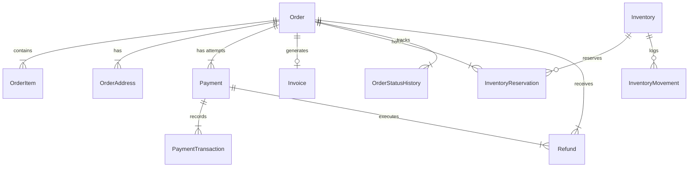

# Data Model & State Lifecycle: Razorpay Payment Integration

**Feature**: Secure Razorpay Payment Integration  
**Spec Directory**: `specs/007-razorpay-payment`  
**Date**: 2026-09-12  

---

## 1. Entity Relationships



---

## 2. Core Entities & Field Mappings

### `Order` (Existing Model)
| Field | Type | Description |
| :--- | :--- | :--- |
| `id` | `UUID` (PK) | Unique internal order identifier |
| `orderNumber` | `VarChar(50)` (Unique) | Human-readable order reference (`ORD-...`), used as Razorpay `receipt` |
| `userId` | `UUID` (Nullable) | Associated user or null for guest |
| `status` | `OrderStatus` | `PENDING` $\rightarrow$ `CONFIRMED` $\rightarrow$ `PROCESSING` $\rightarrow$ `SHIPPED` $\rightarrow$ `DELIVERED` / `CANCELLED` |
| `totalAmount` | `Decimal(19,4)` | Final authoritative payable total in INR |
| `currency` | `Char(3)` | Default `"INR"` |
| `customerEmail`| `Citext` | Customer contact email |
| `placedAt` | `Timestamptz` | Placed timestamp |

### `Payment` (Existing Model)
| Field | Type | Description |
| :--- | :--- | :--- |
| `id` | `UUID` (PK) | Unique payment record ID |
| `orderId` | `UUID` (FK) | Reference to `Order.id` |
| `provider` | `VarChar(100)` | `"RAZORPAY"` (or `"COD"`) |
| `providerPaymentId` | `VarChar(255)` (Unique) | Razorpay Order ID (`order_...`) |
| `status` | `PaymentStatus` | `PENDING` $\rightarrow$ `CAPTURED` / `FAILED` / `REFUNDED` |
| `currency` | `Char(3)` | `"INR"` |
| `amount` | `Decimal(19,4)` | Total amount in INR |
| `metadata` | `Json` | Key-value store for Razorpay order ID, receipt, notes |
| `failureCode` | `VarChar(100)` | Razorpay error code if failed |
| `failureMessage`| `Text` | Razorpay error description |
| `capturedAt` | `Timestamptz` | Timestamp when payment was verified/captured |

### `PaymentTransaction` (Existing Model)
| Field | Type | Description |
| :--- | :--- | :--- |
| `id` | `UUID` (PK) | Unique transaction ID |
| `paymentId` | `UUID` (FK) | Reference to `Payment.id` |
| `transactionType` | `PaymentTransactionType`| `CAPTURE`, `AUTHORIZATION`, `REFUND` |
| `providerTransactionId`| `VarChar(255)` (Unique)| Razorpay Payment ID (`pay_...`) or Refund ID (`rfnd_...`) |
| `amount` | `Decimal(19,4)` | Amount processed |
| `currency` | `Char(3)` | `"INR"` |
| `status` | `PaymentStatus` | `CAPTURED`, `FAILED`, `REFUNDED` |
| `gatewayResponse` | `Json` | Raw webhook/callback response payload for audit |
| `createdAt` | `Timestamptz` | Transaction timestamp |

### `InventoryReservation` (Existing Model)
| Field | Type | Description |
| :--- | :--- | :--- |
| `id` | `UUID` (PK) | Unique reservation ID |
| `variantId` | `UUID` (FK) | Reference to `ProductVariant.id` |
| `orderId` | `UUID` (FK) | Reference to `Order.id` |
| `quantity` | `Int` | Quantity reserved |
| `expiresAt` | `Timestamptz` | 15 minutes after order creation |
| `releasedAt` | `Timestamptz` (Nullable)| Set when captured (fulfilled) or expired/cancelled |

### `Refund` (Existing Model)
| Field | Type | Description |
| :--- | :--- | :--- |
| `id` | `UUID` (PK) | Unique refund record ID |
| `orderId` | `UUID` (FK) | Reference to `Order.id` |
| `paymentId` | `UUID` (FK) | Reference to `Payment.id` |
| `amount` | `Decimal(19,4)` | Refunded amount |
| `currency` | `Char(3)` | `"INR"` |
| `status` | `RefundStatus` | `COMPLETED`, `PENDING`, `FAILED` |
| `providerRefundId` | `VarChar(255)` (Unique)| Razorpay Refund ID (`rfnd_...`) |
| `reason` | `Text` | Reason for refund |
| `processedAt` | `Timestamptz` | Processed timestamp |

---

## 3. State Machine & Transition Rules

```text
[Order Placement]
  └── Order: PENDING
  └── Payment: PENDING (providerPaymentId = "order_...")
  └── Inventory: quantityReserved += qty
  └── InventoryReservation: active (expiresAt = now + 15m)

[Payment Verification / Webhook: order.paid / payment.captured]
  ├── Signature Verified (HMAC SHA-256)
  ├── Payment: PENDING → CAPTURED (capturedAt = now)
  ├── PaymentTransaction: created (type: CAPTURE, providerTransactionId = "pay_...")
  ├── Order: PENDING → CONFIRMED (statusHistory logged)
  ├── Inventory: quantityOnHand -= qty, quantityReserved -= qty
  ├── InventoryMovement: created (type: SALE, ref: Order.id)
  ├── InventoryReservation: releasedAt = now
  ├── Invoice: created (status: PAID)
  ├── CouponUsage: created (if coupon applied)
  └── User Cart: cleared

[Payment Failure / Modal Dismissal]
  ├── PaymentTransaction: created (status: FAILED, failureCode, failureMessage)
  ├── Payment: FAILED (remains linked to Order)
  └── Order: remains PENDING (allows retry within 15-min TTL)

[Order Cancellation / Reservation Expired]
  ├── Inventory: quantityReserved -= qty
  ├── InventoryReservation: releasedAt = now
  └── Order: PENDING → CANCELLED
```
