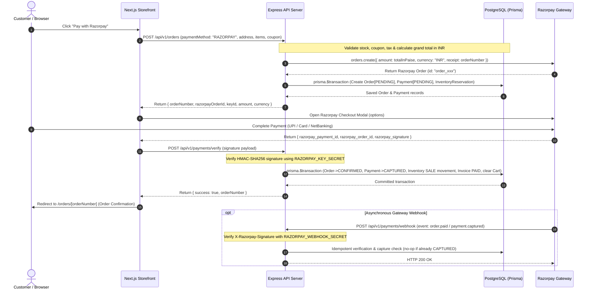
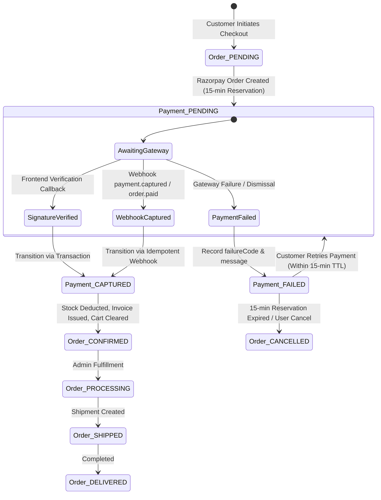

# Feature Specification: Secure Razorpay Payment Integration

**Feature Branch**: `feature/razorpay-payment`  
**Spec Directory**: `specs/007-razorpay-payment`  
**Created**: 2026-09-12  
**Status**: Draft  
**Input**: User description: "Secure Razorpay Payment Integration for the Existing E-commerce Application"

---

## Clarifications

### Session 2026-09-12
- Q: How should the order creation and payment initiation lifecycle be sequenced between the backend database and Razorpay? → A: Internal Order Created First in PENDING status: `POST /api/v1/orders` creates the Order & Payment in PENDING state with 15-min stock reservation and returns Razorpay order details. Verification/Webhook then marks it CONFIRMED.
- Q: How should payment retries on failed, declined, or cancelled Razorpay checkout attempts be handled? → A: Reuse Same Internal Order: When a payment fails or is dismissed, the order remains in PENDING status and the customer can click 'Retry Payment' to initiate a new Razorpay checkout on the existing order as long as the 15-min reservation is active.
- Q: What scope of Razorpay refund handling should be included in this payment integration feature? → A: Backend Service & Admin Refund Endpoint Included: Provide the core backend service and admin endpoint (`POST /api/v1/admin/payments/:id/refund`) to initiate Razorpay API refunds and record Refund entities, integrated with existing Prisma schema.

---

## Existing System Analysis & Architectural Grounding

### 1. Repository Architecture & Stack
The AIRAVÉ platform is structured as a TypeScript monorepo with an Express REST API backend and a Next.js 16 (React 19) storefront frontend, connected to a PostgreSQL database via Prisma ORM.

- **Frontend (`frontend/`)**: Next.js 16 App Router, React 19, Tailwind CSS v4, Lucide Icons, Sonner notifications, custom `CartContext` and `AuthContext`.
- **Backend (`backend/`)**: Node.js Express REST API, TypeScript, Prisma ORM, PostgreSQL (with extensions `citext` and `pgcrypto`), Winston/Morgan logging, Zod validation, JWT & Firebase authentication.
- **Admin Panel (`admin/`)**: Next.js 16 administrative console with RBAC middleware (`requireAdminAuth`, `requirePermission`).
- **Database (`backend/prisma/schema.prisma`)**: Full e-commerce schema containing `Order`, `OrderItem`, `OrderAddress`, `Payment`, `PaymentTransaction`, `Invoice`, `Inventory`, `InventoryReservation`, `InventoryMovement`, `Coupon`, `CouponUsage`, `AuditLog`, and `OrderStatusHistory`.

### 2. Current End-to-End Checkout Flow & API Mapping
1. **Cart & Item Selection**: Users browse products and add variant selections (`selectedSize`, `selectedColor`, `variantId`) to cart stored in local storage and synced to the database for authenticated users.
2. **Authoritative Calculation**: On `/checkout`, the frontend calls `POST /api/v1/orders/checkout/summary` (`CheckoutService.calculateCheckoutSummary`). Pricing, coupon discounts, shipping costs, and GST taxes are computed dynamically against database records.
3. **Address & Speed Selection**: User selects or inputs a delivery address (`AddressCheckoutSection`) and chooses shipping speed (`STANDARD` or `EXPRESS`).
4. **Order Submission**: The checkout form submits to `POST /api/v1/orders` (`OrderService.createOrder`).
   - For `RAZORPAY`: Order is created in `PENDING` status, `Payment` in `PENDING` status, 15-minute `InventoryReservation` created, and Razorpay order (`orders.create`) generated on backend.
   - For `COD`: Order is created in `CONFIRMED` status with `Payment` in `PENDING` status and physical stock deducted immediately.
5. **Payment Verification**: Frontend invokes Razorpay Checkout modal. On completion, submits `razorpay_order_id`, `razorpay_payment_id`, and `razorpay_signature` to `POST /api/v1/payments/verify`.
6. **Webhook Fallback**: Razorpay posts signed webhooks (`order.paid`, `payment.captured`, `payment.failed`, `refund.processed`) to `POST /api/v1/payments/webhook`.

### 3. Database Model & Status Enums
- **`Order` Statuses**: `PENDING`, `CONFIRMED`, `PROCESSING`, `SHIPPED`, `DELIVERED`, `CANCELLED`, `PARTIALLY_CANCELLED`, `REFUNDED`, `PARTIALLY_REFUNDED`, `FAILED`.
- **`Payment` Statuses**: `PENDING`, `AUTHORIZED`, `CAPTURED`, `PARTIALLY_REFUNDED`, `REFUNDED`, `FAILED`, `CANCELLED`.
- **`PaymentTransaction` Types**: `AUTHORIZATION`, `CAPTURE`, `SALE`, `REFUND`, `VOID`, `CHARGEBACK`.
- **`Refund` Statuses**: `PENDING`, `PROCESSING`, `COMPLETED`, `FAILED`, `CANCELLED`.
- **`Invoice` Statuses**: `DRAFT`, `ISSUED`, `PAID`, `CANCELLED`, `REFUNDED`.

---

## Architectural Sequence & State Flows

### Payment Initiation, Verification & Webhook Sequence

### Order and Payment State Transition Machine

---

## User Scenarios & Acceptance Criteria *(mandatory)*

### User Story 1 - Seamless & Authoritative Online Payment (Priority: P1)

As an authenticated or guest customer checking out on AIRAVÉ,  
I want to pay for my selected items securely using Razorpay (UPI, Credit/Debit Cards, NetBanking),  
So that my payment is instantly verified and my order is confirmed with stock reserved.

**Why this priority**: Core revenue-generating transaction flow. Without payment capture and signature verification, online transactions cannot proceed.

**Independent Test**: Can be tested by adding items to cart, proceeding to checkout, choosing Razorpay, completing payment using Razorpay Test Mode, and verifying order status transitions to `CONFIRMED` and payment to `CAPTURED`.

**Acceptance Scenarios**:
1. **Given** a customer with valid items and selected delivery address on `/checkout`,  
   **When** they submit order creation with `paymentMethod: "RAZORPAY"`,  
   **Then** the backend computes the authoritative payable total, creates an internal order in `PENDING` status, creates a 15-minute `InventoryReservation`, creates a Razorpay order via Razorpay API, and returns `razorpayOrderId`, `keyId`, `amount`, and `currency` without exposing secrets.
2. **Given** the customer completes payment in the Razorpay Checkout modal,  
   **When** the frontend submits `razorpay_order_id`, `razorpay_payment_id`, and `razorpay_signature` to `POST /api/v1/payments/verify`,  
   **Then** the backend verifies the cryptographic HMAC SHA-256 signature, transitions `Payment` to `CAPTURED` and `Order` to `CONFIRMED`, deducts physical inventory (`quantityOnHand`), issues an `Invoice` with status `PAID`, clears the user's cart, and returns order confirmation data.

---

### User Story 2 - Resilient Webhook Processing & Disconnected Browser Recovery (Priority: P1)

As an e-commerce platform operator,  
I want the backend to process asynchronous Razorpay webhooks (`order.paid`, `payment.captured`, `payment.failed`, `refund.processed`),  
So that orders are reliably confirmed even if the customer's browser crashes, network disconnects, or frontend verification fails.

**Why this priority**: Prevents lost orders and money-taken-no-order scenarios caused by client drops or interrupted connections.

**Independent Test**: Can be tested by initiating checkout, simulating a successful payment callback in Razorpay gateway, aborting the frontend verification call, firing a signed Razorpay webhook to `/api/v1/payments/webhook`, and asserting the order is properly transitioned to `CONFIRMED`.

**Acceptance Scenarios**:
1. **Given** a valid order in `PENDING` status,  
   **When** Razorpay sends a signed `order.paid` or `payment.captured` webhook to `/api/v1/payments/webhook` with a valid `X-Razorpay-Signature`,  
   **Then** the backend verifies the signature against the raw body using `RAZORPAY_WEBHOOK_SECRET`, transitions the payment to `CAPTURED` and order to `CONFIRMED`, creates sales inventory movements, and returns `200 OK`.
2. **Given** an order that has already been verified and marked `CAPTURED` via the frontend verification endpoint,  
   **When** the corresponding Razorpay webhook arrives later,  
   **Then** the backend recognizes the payment is already `CAPTURED` and returns `200 OK` idempotently without double-deducting stock or duplicating invoices.
3. **Given** an order that was captured via webhook before the customer's browser submits the verification payload,  
   **When** the frontend verification API is called,  
   **Then** the backend responds with success and the existing confirmed order details without throwing errors.

---

### User Story 3 - Graceful Payment Failure & Retry Flow (Priority: P2)

As a customer whose payment attempt failed or was cancelled at the gateway,  
I want to see clear failure feedback and have the option to retry payment on my order,  
So that I can complete my purchase without re-entering my entire cart or creating duplicate conflicting orders.

**Why this priority**: High impact on conversion rates and checkout recovery.

**Independent Test**: Can be tested by triggering a failed or dismissed payment in Razorpay modal, verifying that the order remains in `PENDING` state with a recorded failed payment transaction, and retrying payment via a dedicated retry action.

**Acceptance Scenarios**:
1. **Given** a customer dismisses the Razorpay modal or experiences an issuer decline,  
   **When** the frontend notifies the backend or the gateway sends a `payment.failed` webhook,  
   **Then** the backend records a `PaymentTransaction` with status `FAILED` along with `failureCode` and `failureMessage`, leaving the `Order` in `PENDING` status while the reservation window is active.
2. **Given** an order in `PENDING` status with an active inventory reservation,  
   **When** the customer clicks "Retry Payment" on the order details page or checkout,  
   **Then** the backend reuses the existing internal `Order` record and provides valid Razorpay payment initialization data without creating a new duplicate order.

---

### User Story 4 - Admin Payment Management & Refund Processing (Priority: P2)

As an authorized store administrator,  
I want to view transaction logs and initiate Razorpay refunds for returned or cancelled orders,  
So that customer refunds are processed through the gateway with full audit traceability.

**Why this priority**: Required for customer service, dispute resolution, and store compliance.

**Independent Test**: Can be tested by executing `POST /api/v1/admin/payments/:id/refund` with admin authentication and verifying that the Razorpay Refund API is invoked and a `Refund` record is persisted.

**Acceptance Scenarios**:
1. **Given** an admin with `payments:write` permission,  
   **When** they initiate a refund for a captured payment,  
   **Then** the backend invokes Razorpay's refund API (`payments.refund`), creates a `Refund` record with status `COMPLETED`, transitions `Payment` to `REFUNDED` or `PARTIALLY_REFUNDED`, and logs an `AuditLog` entry.

---

## Requirements *(mandatory)*

### Functional Requirements

#### A. Checkout & Payment Initiation
- **FR-001**: System MUST calculate all pricing, variant prices, discounts, shipping fees, and taxes authoritative on the backend (`CheckoutService.calculateCheckoutSummary`) and reject any client-tampered totals.
- **FR-002**: System MUST convert the total amount to paise for INR (`amount * 100`) when creating the Razorpay order.
- **FR-003**: System MUST create an internal `Order` record in `PENDING` status and an `InventoryReservation` with a 15-minute expiration timestamp upon online order initiation.
- **FR-004**: System MUST return only safe initialization data to the frontend: `razorpayOrderId`, `keyId` (public key only), `amount` (in paise/rupees), `currency` ("INR"), and `orderNumber`.

#### B. Payment Verification
- **FR-005**: System MUST verify the HMAC SHA-256 signature using `RAZORPAY_KEY_SECRET` over the concatenated payload `razorpay_order_id + "|" + razorpay_payment_id`.
- **FR-006**: System MUST verify that the `razorpay_order_id` in the verification payload matches the `providerPaymentId` stored in the internal `Payment` record for that specific order.
- **FR-007**: System MUST perform all state updates (marking `Payment` `CAPTURED`, `Order` `CONFIRMED`, logging `PaymentTransaction`, creating `Invoice`, deducting stock, releasing reservations, recording `CouponUsage`) inside a single atomic Prisma transaction (`prisma.$transaction`).
- **FR-008**: System MUST ensure payment verification is strictly idempotent; duplicate verification requests for an already `CAPTURED` payment MUST return the confirmed order details without re-executing stock deductions.

#### C. Webhook Processing
- **FR-009**: System MUST expose a dedicated public webhook route at `POST /api/v1/payments/webhook` that does NOT require user authentication cookies/JWT headers.
- **FR-010**: System MUST verify the `X-Razorpay-Signature` header using HMAC SHA-256 with `RAZORPAY_WEBHOOK_SECRET` computed over the raw request payload buffer before parsing JSON.
- **FR-011**: System MUST handle supported webhook events: `order.paid`, `payment.captured`, `payment.failed`, and `refund.processed`.
- **FR-012**: System MUST safely handle out-of-order, duplicate, and delayed webhooks, guaranteeing that an order is never double-processed.
- **FR-013**: System MUST return HTTP 200 OK to Razorpay promptly upon successful processing or idempotent deduplication to prevent gateway retries.

#### D. Order & Payment Consistency & Retries
- **FR-014**: System MUST maintain distinct status fields for `Order` (`OrderStatus`: `PENDING`, `CONFIRMED`, `PROCESSING`, `SHIPPED`, `CANCELLED`, `REFUNDED`) and `Payment` (`PaymentStatus`: `PENDING`, `AUTHORIZED`, `CAPTURED`, `FAILED`, `REFUNDED`).
- **FR-015**: System MUST NEVER transition an order to `CONFIRMED` solely based on client-side state without verified signature or verified webhook.
- **FR-016**: System MUST allow payment retries on `PENDING` orders without generating duplicate `Order` records.
- **FR-017**: System MUST record diagnostic error codes (`failureCode`, `failureMessage`, gateway responses) on `Payment` and `PaymentTransaction` upon payment failures.

#### E. Admin & Refunds
- **FR-018**: System MUST provide backend service and administrative endpoint (`POST /api/v1/admin/payments/:id/refund`) requiring `payments:write` permissions to execute gateway refunds via Razorpay API and record `Refund` entities.

---

### Non-Functional & Security Requirements

- **SEC-001 (Zero Secret Exposure)**: `RAZORPAY_KEY_SECRET` and `RAZORPAY_WEBHOOK_SECRET` MUST NEVER be exposed to frontend code, client bundles, or version control. Only `RAZORPAY_KEY_ID` (public) is exposed via environment variables.
- **SEC-002 (PII & PCI Redaction)**: Raw payment credentials (card numbers, CVVs, PINs) MUST NEVER touch the application server or be stored in the database. Logs MUST redact authorization tokens and signature keys.
- **SEC-003 (Raw Body Preservation)**: The Express application MUST preserve the raw buffer for incoming requests on `/api/v1/payments/webhook` to ensure cryptographic integrity of webhook signature verification.
- **SEC-004 (Performance & Latency)**: Signature verification and atomic order confirmation MUST complete in under 500ms under standard database load.
- **SEC-005 (UI Compliance)**: All checkout and payment confirmation UI components MUST strictly adhere to the project rule using **Be Vietnam Pro** typography and monochrome palette without monospace fonts or yellow accent colors.

---

## Key Entities & Data Mapping

| Entity / Model | Role in Payment Flow | Key Fields & State Mappings |
| :--- | :--- | :--- |
| **`Order`** | Internal order container | `id`, `orderNumber`, `userId`, `status` (`PENDING` $\rightarrow$ `CONFIRMED` $\rightarrow$ `PROCESSING`), `totalAmount`, `currency` ("INR") |
| **`Payment`** | High-level payment lifecycle | `id`, `orderId`, `provider` ("RAZORPAY"), `providerPaymentId` (Razorpay Order ID `order_...`), `status` (`PENDING` $\rightarrow$ `CAPTURED` / `FAILED`), `amount` |
| **`PaymentTransaction`** | Individual gateway transaction event | `id`, `paymentId`, `transactionType` (`CAPTURE` / `AUTHORIZATION` / `REFUND`), `providerTransactionId` (Razorpay Payment ID `pay_...`), `gatewayResponse` (JSON) |
| **`Refund`** | Admin-initiated or webhook refund | `id`, `orderId`, `paymentId`, `amount`, `status` (`COMPLETED`), `providerRefundId` (Razorpay Refund ID `rfnd_...`) |
| **`InventoryReservation`** | Stock hold during checkout | `id`, `variantId`, `orderId`, `quantity`, `expiresAt` (15-min TTL), `releasedAt` |
| **`InventoryMovement`** | Immutable stock ledger | `id`, `variantId`, `movementType` (`SALE`), `quantity` (negative deduction), `referenceType` ("ORDER"), `referenceId` |
| **`Invoice`** | Tax invoice generated upon capture | `id`, `orderId`, `invoiceNumber`, `status` (`PAID`), `totalAmount`, `paidAt` |

---

## Edge Cases & Failure Scenarios

| Failure Scenario | Trigger Condition | System Handling & Resolution |
| :--- | :--- | :--- |
| **Double-Click "Pay"** | User taps submit button multiple times in rapid succession | Frontend disables button with spinner; backend prevents duplicate Razorpay order creation. |
| **Browser Closes After Payment** | User completes payment in gateway, but closes browser before redirect | Razorpay webhook (`order.paid` / `payment.captured`) delivers event to backend, which confirms order, deducts stock, and sends confirmation email. |
| **Webhook Arrives Before Frontend Verification** | Gateway webhook reaches server faster than user's browser redirects | Webhook captures payment and confirms order; subsequent frontend verification recognizes `CAPTURED` state and returns success cleanly. |
| **Signature Mismatch / Tampering** | Malicious actor modifies payment ID or amount in frontend verification payload | HMAC SHA-256 verification fails; request is rejected with HTTP 400 Bad Request and security audit is logged. |
| **Payment Declined / Dismissed** | Insufficient funds or user clicks close on Razorpay modal | Gateway returns error; frontend displays user-friendly error message with "Try Again" button; order stays `PENDING` until expired. |
| **Reservation Expiry** | User abandons payment modal for >15 minutes | Background job or next stock check releases reservation; order marked `CANCELLED` if payment is attempted after expiry. |
| **Network Timeout During Verification** | Server encounters database timeout during verification | Client receives retryable error; webhook serves as automated fallback to finalize order. |

---

## Success Criteria *(mandatory)*

### Measurable Outcomes
- **SC-001**: 100% of successfully completed Razorpay payments result in a cryptographically verified signature or webhook before the order is marked `CONFIRMED`.
- **SC-002**: Payment verification and order confirmation transactions complete in under 500ms on the backend.
- **SC-003**: 0% inventory discrepancies or negative stock events during concurrent checkout of high-demand items due to atomic reservation and sale movements.
- **SC-004**: 100% of duplicate webhook deliveries and duplicate verification submissions are handled idempotently without duplicate stock deductions or duplicate invoice creations.
- **SC-005**: Zero leakage of secret keys (`RAZORPAY_KEY_SECRET`, `RAZORPAY_WEBHOOK_SECRET`) to the browser bundle or client-facing responses.

---

## Assumptions

1. **Gateway Account**: Razorpay API credentials (`RAZORPAY_KEY_ID`, `RAZORPAY_KEY_SECRET`, `RAZORPAY_WEBHOOK_SECRET`) are provided in environment variables for development and production.
2. **Currency**: All store transactions are denominated in Indian Rupees (`INR`).
3. **Cart Persistence**: User cart items are stored in PostgreSQL for authenticated users and local storage for guests; successful order capture clears items associated with the order.
4. **Script Loading**: Razorpay Checkout SDK script (`https://checkout.razorpay.com/v1/checkout.js`) is loaded dynamically or via Next.js `<Script>` in the checkout client component.
5. **Existing UI Patterns**: Checkout design, drawer components, address selection, and toasts follow existing Airavé monochrome UI rules without introducing monospace fonts.

---

## Unknowns & Investigation Items

- None. All database models, checkout calculations, order services, route configurations, and validation structures have been fully inspected in the workspace.

---

## Files Inspected

- Database Schema: [backend/prisma/schema.prisma](file:///d:/CS-Next/backend/prisma/schema.prisma)
- Backend App & Server: [backend/src/app.ts](file:///d:/CS-Next/backend/src/app.ts), [backend/src/server.ts](file:///d:/CS-Next/backend/src/server.ts)
- Backend Routes: [backend/src/routes/payments.routes.ts](file:///d:/CS-Next/backend/src/routes/payments.routes.ts), [backend/src/routes/orders.routes.ts](file:///d:/CS-Next/backend/src/routes/orders.routes.ts), [backend/src/routes/admin/payments.routes.ts](file:///d:/CS-Next/backend/src/routes/admin/payments.routes.ts)
- Backend Controllers: [backend/src/controllers/payment.controller.ts](file:///d:/CS-Next/backend/src/controllers/payment.controller.ts), [backend/src/controllers/order.controller.ts](file:///d:/CS-Next/backend/src/controllers/order.controller.ts), [backend/src/controllers/checkout.controller.ts](file:///d:/CS-Next/backend/src/controllers/checkout.controller.ts)
- Backend Services: [backend/src/services/payment.service.ts](file:///d:/CS-Next/backend/src/services/payment.service.ts), [backend/src/services/order.service.ts](file:///d:/CS-Next/backend/src/services/order.service.ts), [backend/src/services/checkout.service.ts](file:///d:/CS-Next/backend/src/services/checkout.service.ts)
- Backend Middleware & Validators: [backend/src/middleware/auth.ts](file:///d:/CS-Next/backend/src/middleware/auth.ts), [backend/src/validators/order.validator.ts](file:///d:/CS-Next/backend/src/validators/order.validator.ts)
- Frontend Checkout & API: [frontend/src/app/(shop)/checkout/page.tsx](file:///d:/CS-Next/frontend/src/app/%28shop%29/checkout/page.tsx), [frontend/src/lib/orderApi.ts](file:///d:/CS-Next/frontend/src/lib/orderApi.ts)
