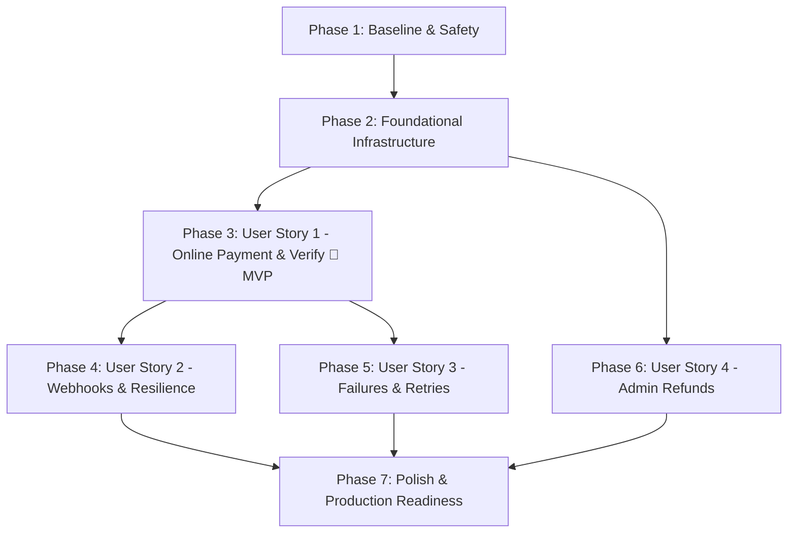

# Tasks: Secure Razorpay Payment Integration

**Feature**: Secure Razorpay Payment Integration  
**Branch**: `feature/razorpay-payment` | **Date**: 2026-09-12  
**Spec**: [spec.md](file:///d:/CS-Next/specs/007-razorpay-payment/spec.md) | **Plan**: [plan.md](file:///d:/CS-Next/specs/007-razorpay-payment/plan.md)  

---

## Phase 1: Baseline & Safety Verification (Setup)

**Purpose**: Confirm current workspace state, database schema status, and baseline environment stability prior to implementing payment features.

- [x] T001 Verify backend and frontend compilation and test readiness in `backend/package.json` and `frontend/package.json`
- [x] T002 Verify Prisma schema status and generate Prisma client in `backend/prisma/schema.prisma`
- [x] T003 [P] Verify environment variable templates and test credentials in `backend/.env.example` and `frontend/.env.example`
- [x] T004 [P] Verify Git branch isolation on `feature/razorpay-payment` and document rollback checkpoint

---

## Phase 2: Foundational Payment Infrastructure & Raw Body Processing

**Purpose**: Core backend and frontend infrastructure required before user story implementations.

- [x] T005 Install `razorpay` Node SDK dependency in `backend/package.json`
- [x] T006 Implement Razorpay singleton client and credential loader in `backend/src/config/razorpay.ts`
- [x] T007 Configure `express.json` verify callback to preserve `req.rawBody` for webhook verification in `backend/src/app.ts`
- [x] T008 [P] Define Zod schemas for payment verification and refunds in `backend/src/validators/payment.validator.ts`
- [x] T009 [P] Define frontend Razorpay SDK and response TypeScript interfaces in `frontend/src/types/payment.ts`

**Checkpoint**: Foundational libraries, configuration loaders, and body parsers ready.

---

## Phase 3: User Story 1 - Seamless & Authoritative Online Payment (Priority: P1) 🎯 MVP

**Goal**: Enable customers to initiate checkout with Razorpay, receive safe initialization parameters, complete payment in Razorpay Checkout modal, and have payment cryptographically verified and captured on backend.

**Independent Test**: Complete checkout with Razorpay Test Mode, verify signature on backend, confirm order transitions to `CONFIRMED`, `Payment` to `CAPTURED`, stock deducted, invoice created, and cart cleared.

### Tests for User Story 1
- [x] T010 [P] [US1] Unit test for HMAC-SHA256 signature verification in `backend/src/tests/paymentSignature.test.ts`
- [x] T011 [P] [US1] Integration test for Razorpay order initiation in `backend/src/tests/orderPaymentInitiation.test.ts`
- [x] T012 [P] [US1] Integration test for `/payments/verify` atomic capture in `backend/src/tests/paymentVerification.test.ts`

### Implementation for User Story 1
- [x] T013 [US1] Implement `createRazorpayOrder` method in `backend/src/services/payment.service.ts`
- [x] T014 [US1] Update `OrderService.createOrder` in `backend/src/services/order.service.ts` to branch on `paymentMethod === "RAZORPAY"` (sets `Order.status: PENDING`, `Payment.status: PENDING`, creates 15-min `InventoryReservation`)
- [x] T015 [US1] Implement `verifyPaymentSignature` and atomic transaction capture in `backend/src/services/payment.service.ts`
- [x] T016 [US1] Implement `verifyPayment` handler in `backend/src/controllers/payment.controller.ts`
- [x] T017 [US1] Expose `POST /verify` route in `backend/src/routes/payments.routes.ts`
- [x] T018 [US1] Implement `verifyPaymentApi` client in `frontend/src/lib/paymentApi.ts`
- [x] T019 [US1] Update `placeOrderApi` return types in `frontend/src/lib/orderApi.ts` to include Razorpay initialization payload
- [x] T020 [US1] Integrate Razorpay Checkout SDK script and payment handler in `frontend/src/app/(shop)/checkout/page.tsx`

**Checkpoint**: User Story 1 functional — customers can complete end-to-end checkout with signature verification and order confirmation.

---

## Phase 4: User Story 2 - Resilient Webhook Processing & Browser Recovery (Priority: P1)

**Goal**: Process asynchronous Razorpay webhooks (`order.paid`, `payment.captured`, `payment.failed`, `refund.processed`) to guarantee order confirmation even if the customer's browser crashes or drops connection.

**Independent Test**: Trigger simulated signed Razorpay webhook to `/api/v1/payments/webhook`, verify signature against raw body, assert order confirmation and idempotent duplicate handling.

### Tests for User Story 2
- [x] T021 [P] [US2] Unit test for webhook HMAC-SHA256 signature verification in `backend/src/tests/webhookSignature.test.ts`
- [x] T022 [P] [US2] Integration test for webhook-before-verification and verification-before-webhook races in `backend/src/tests/webhookIdempotency.test.ts`

### Implementation for User Story 2
- [x] T023 [US2] Implement `handleWebhookEvent` with HMAC verification and atomic idempotent capture in `backend/src/services/payment.service.ts`
- [x] T024 [US2] Implement `handleWebhook` controller action in `backend/src/controllers/payment.controller.ts`
- [x] T025 [US2] Expose public `POST /webhook` route in `backend/src/routes/payments.routes.ts`
- [x] T026 [US2] Implement `PaymentTransaction` logging and `AuditLog` persistence for webhook events in `backend/src/services/payment.service.ts`

**Checkpoint**: User Stories 1 and 2 functional — payment capture is fully resilient to client drops and delayed webhook delivery.

---

## Phase 5: User Story 3 - Graceful Payment Failure, Modal Dismissal & Retry (Priority: P2)

**Goal**: Handle gateway rejections, user dismissals, and network errors gracefully while allowing customers to retry payment on existing `PENDING` orders without cart duplication.

**Independent Test**: Dismiss or trigger failure in Razorpay modal, verify `PaymentTransaction` logs `FAILED`, order remains `PENDING` within 15-min TTL, and "Retry Payment" completes under the same `orderNumber`.

### Tests for User Story 3
- [x] T027 [P] [US3] Unit test for failure state transitions and reservation expiry in `backend/src/tests/paymentFailure.test.ts`
- [x] T028 [P] [US3] Frontend test for modal dismissal and retry toast in `frontend/src/tests/checkoutFailure.test.tsx`

### Implementation for User Story 3
- [x] T029 [US3] Implement `recordPaymentFailure` in `backend/src/services/payment.service.ts` to log `PaymentTransaction` with failure code and message
- [x] T030 [US3] Implement payment retry endpoint `POST /api/v1/payments/:orderNumber/retry` in `backend/src/routes/payments.routes.ts` and `backend/src/controllers/payment.controller.ts`
- [x] T031 [US3] Add retry client method `retryPaymentApi` in `frontend/src/lib/paymentApi.ts`
- [x] T032 [US3] Update `frontend/src/app/(shop)/checkout/page.tsx` with modal dismissal handlers, error alerts, and retry action

**Checkpoint**: User Story 3 functional — failures leave consistent state and provide clean customer recovery.

---

## Phase 6: User Story 4 - Admin Payment Management & Gateway Refunds (Priority: P2)

**Goal**: Enable store administrators with `payments:write` permissions to view transaction logs and initiate Razorpay gateway refunds with audit traceability.

**Independent Test**: Execute `POST /api/v1/admin/payments/:id/refund` with admin credentials, verify Razorpay refund API invocation, and confirm `Refund` record persistence.

### Tests for User Story 4
- [x] T033 [P] [US4] Integration test for admin refund authorization and execution in `backend/src/tests/adminRefund.test.ts`

### Implementation for User Story 4
- [x] T034 [US4] Implement `refundPayment` method invoking Razorpay Refund API and creating `Refund` entity in `backend/src/services/admin/payments.service.ts`
- [x] T035 [US4] Implement `refundPayment` controller action in `backend/src/controllers/admin/payments.controller.ts`
- [x] T036 [US4] Expose `POST /:id/refund` route with `requirePermission("payments:write")` in `backend/src/routes/admin/payments.routes.ts`

**Checkpoint**: User Story 4 functional — admin refunds and payment auditing operational.

---

## Phase 7: Polish, Security Hardening & Production Readiness

**Purpose**: Cross-cutting quality gates, security audits, and production verification.

- [x] T037 [P] Audit all logs across `backend/src/services/payment.service.ts` to guarantee zero leakage of secret keys, full card numbers, or PII
- [x] T038 [P] Verify strict typography compliance (Be Vietnam Pro only, zero monospace/font-mono) in `frontend/src/app/(shop)/checkout/page.tsx`
- [x] T039 Execute full end-to-end test scenarios from `specs/007-razorpay-payment/quickstart.md`
- [x] T040 [P] Create production environment deployment checklist in `specs/007-razorpay-payment/deployment.md`

---

## Task Details & Quality Metadata

### T001 to T004: Baseline Verification
- **Files**: `backend/package.json`, `frontend/package.json`, `backend/prisma/schema.prisma`, `backend/.env.example`, `frontend/.env.example`
- **Dependencies**: None
- **Database Impact**: Read-only validation
- **API Impact**: None
- **Security Impact**: Baseline safety check
- **Acceptance Criteria**: Both backend and frontend compile without errors; test credentials documented in `.env.example`.
- **Rollback Consideration**: Non-destructive.

### T005 to T009: Foundational Infrastructure
- **Files**: `backend/src/config/razorpay.ts`, `backend/src/app.ts`, `backend/src/validators/payment.validator.ts`, `frontend/src/types/payment.ts`
- **Dependencies**: T001
- **Database Impact**: None
- **API Impact**: Preserves `req.rawBody` in Express for cryptographic verification
- **Security Impact**: Isolates Razorpay secret keys to backend configuration; types prevent runtime payload bugs
- **Acceptance Criteria**: `req.rawBody` accessible in route handlers; Zod validator rejects malformed verification payloads.
- **Rollback Consideration**: Revert `app.ts` middleware changes.

### T010 to T020: User Story 1 (Online Payment & Verification)
- **Files**: `backend/src/services/payment.service.ts`, `backend/src/services/order.service.ts`, `backend/src/controllers/payment.controller.ts`, `backend/src/routes/payments.routes.ts`, `frontend/src/lib/paymentApi.ts`, `frontend/src/lib/orderApi.ts`, `frontend/src/app/(shop)/checkout/page.tsx`
- **Dependencies**: T006, T007, T008, T009
- **Database Impact**: `Order` created in `PENDING`, `Payment` in `PENDING`, `InventoryReservation` created (15-min TTL); on `/verify`, `Payment` $\rightarrow$ `CAPTURED`, `Order` $\rightarrow$ `CONFIRMED`, `InventoryMovement` (`SALE`) logged, `Invoice` created
- **API Impact**: Modifies `POST /api/v1/orders` response for `RAZORPAY`; adds `POST /api/v1/payments/verify`
- **Security Impact**: HMAC SHA-256 signature verification over `razorpay_order_id|razorpay_payment_id`; secrets never exposed to frontend
- **Acceptance Criteria**: 100% verified orders transition to `CONFIRMED`; stock decremented; invoice generated; cart emptied.
- **Rollback Consideration**: Revert service branching in `order.service.ts`.

### T021 to T026: User Story 2 (Webhooks & Resilience)
- **Files**: `backend/src/services/payment.service.ts`, `backend/src/controllers/payment.controller.ts`, `backend/src/routes/payments.routes.ts`
- **Dependencies**: T015
- **Database Impact**: Idempotent update of `Payment` and `Order` inside transaction; creates `PaymentTransaction` and `AuditLog`
- **API Impact**: Adds public `POST /api/v1/payments/webhook`
- **Security Impact**: Verifies `X-Razorpay-Signature` against `RAZORPAY_WEBHOOK_SECRET` over raw body buffer
- **Acceptance Criteria**: Webhooks confirm orders even if browser closed; duplicate webhooks return 200 OK without double stock deduction.
- **Rollback Consideration**: Remove webhook route in `payments.routes.ts`.

### T027 to T032: User Story 3 (Failure Handling & Retries)
- **Files**: `backend/src/services/payment.service.ts`, `backend/src/controllers/payment.controller.ts`, `backend/src/routes/payments.routes.ts`, `frontend/src/lib/paymentApi.ts`, `frontend/src/app/(shop)/checkout/page.tsx`
- **Dependencies**: T015
- **Database Impact**: Records `PaymentTransaction` (`status: FAILED`, `failureCode`, `failureMessage`) without mutating order to confirmed
- **API Impact**: Adds `POST /api/v1/payments/:orderNumber/retry`
- **Security Impact**: Validates user ownership before allowing retry
- **Acceptance Criteria**: Failed/dismissed payments log failure diagnostics and allow seamless retry on same order.
- **Rollback Consideration**: Revert retry route and UI retry handlers.

### T033 to T036: User Story 4 (Admin Refunds)
- **Files**: `backend/src/services/admin/payments.service.ts`, `backend/src/controllers/admin/payments.controller.ts`, `backend/src/routes/admin/payments.routes.ts`
- **Dependencies**: T006, T008
- **Database Impact**: Creates `Refund` record (`status: COMPLETED`), updates `Payment.status` to `REFUNDED` or `PARTIALLY_REFUNDED`, creates `PaymentTransaction` (`type: REFUND`)
- **API Impact**: Adds `POST /api/v1/admin/payments/:id/refund`
- **Security Impact**: Enforces `requireAdminAuth` and `requirePermission("payments:write")`
- **Acceptance Criteria**: Admin can trigger full or partial gateway refunds with audit logging.
- **Rollback Consideration**: Remove admin refund endpoint.

### T037 to T040: Polish, Security & Deployment
- **Files**: `backend/src/services/payment.service.ts`, `frontend/src/app/(shop)/checkout/page.tsx`, `specs/007-razorpay-payment/deployment.md`
- **Dependencies**: T020, T026, T032, T036
- **Database Impact**: None
- **API Impact**: None
- **Security Impact**: Final zero-leakage and typography verification
- **Acceptance Criteria**: All quickstart validation scenarios pass; deployment runbook complete.
- **Rollback Consideration**: Non-destructive.

---

## Dependencies & Execution Order

### Phase Dependencies

### Critical Path
`T001 → T005 → T006 → T007 → T013 → T014 → T015 → T016 → T017 → T020 → T023 → T024 → T025 → T039`

### Parallel Opportunities
- **Setup / Foundational**: `T003`, `T004`, `T008`, `T009` can be developed in parallel.
- **Tests**: `T010`, `T011`, `T012` can be written in parallel before implementation.
- **Frontend & Backend in US1**: `T018`, `T019` can proceed in parallel with `T015`, `T016`.
- **Post-MVP Stories**: User Story 2 (Webhooks), User Story 3 (Retries), and User Story 4 (Admin Refunds) can be implemented in parallel once User Story 1 is verified.

---

## Traceability Matrix: Requirements to Tasks

| Requirement (spec.md) | Description | Associated Tasks |
| :--- | :--- | :--- |
| **FR-001 - FR-004** | Backend pricing calculation, INR paise conversion, 15-min reservation, safe initiation | T013, T014, T019, T020 |
| **FR-005 - FR-008** | HMAC SHA-256 signature verification, atomic fulfillment transaction, idempotency | T010, T012, T015, T016, T017, T018 |
| **FR-009 - FR-013** | Webhook endpoint, raw body verification, event parsing, idempotent capture | T007, T021, T022, T023, T024, T025, T026 |
| **FR-014 - FR-017** | State machine separation, failure recording, payment retry on same order | T027, T028, T029, T030, T031, T032 |
| **FR-018** | Admin gateway refund endpoint with `payments:write` RBAC | T033, T034, T035, T036 |
| **SEC-001 - SEC-005** | Zero secret exposure, PII redaction, raw body preservation, Be Vietnam Pro UI | T006, T007, T037, T038 |
| **SC-001 - SC-005** | Success criteria (100% verified capture, <500ms latency, zero stock leakage) | T015, T023, T039 |
